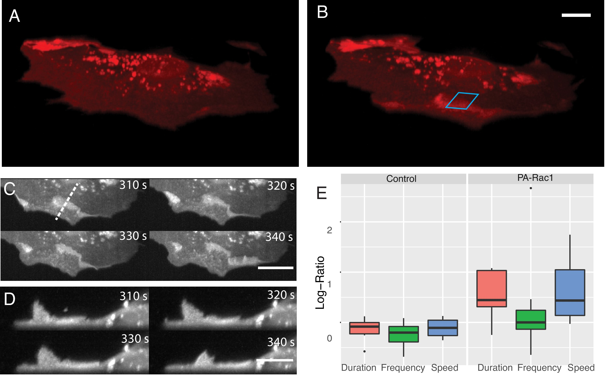

Protrusion Package and Example
================
Jaewon Huh
2022/07/06

Introduction
------------

This documentation describes the usage of the protrusion/retraction package described in the following github account [Jaewon Huh](https://github.com/hergee3169/Protrusion-Retraction-Database-setup). We describe a step by step process from raw data to final analysis result used in the publication.

### Reference

The package has been used for the below publications and more coming. Here, we will be focusing primarily on the first paper for example.

-   [**A versatile oblique plane microscope for large-scale and high-resolution imaging of subcellular dynamics**](https://doi.org/10.7554/eLife.57681), *eLife*, 2020, 9:e57681, written by Etai Sapoznik, Bo-Jui Chang, Jaewon Huh, et al.
-   [**Actin-Membrane Release Initiates Cell Protrusions**](https://doi.org/10.1016/j.devcel.2020.11.024), *Developmental Cell*, 2020, 55(6):723-736, written by Erik S. Welf, Christopher E. Miles, Jaewon Huh, et al.
-   [**Multiplexed GTPase and GEF biosensor imaging enables network connectivity analysis**](https://doi.org/10.1038/s41589-020-0542-9), *Nat. Chem. Biol.*, 2020, 16, 826–833, written by Daniel J. Marston, Marco Vilela, Jaewon Huh, et al.

Raw Velocity Data
-----------------

The data set is as below where Ch0 describes the edge velocity measured in nm/s. cellIndex stands for the cell and windowIndex indicates the location of the measurement in cell. frameIndex is the time point for this data and Label stands for the experimental conditions.

``` r
head(Velocity.df)
```

    ##        Ch0 cellIndex layerIndex windowIndex frameIndex              Label
    ## 1       NA         1          1           1          1 Control_Rac1_After
    ## 2 5.222649         1          1           1          2 Control_Rac1_After
    ## 3 5.348656         1          1           1          3 Control_Rac1_After
    ## 4 4.798946         1          1           1          4 Control_Rac1_After
    ## 5 3.615968         1          1           1          5 Control_Rac1_After
    ## 6 2.247450         1          1           1          6 Control_Rac1_After
    ##   Ch0.NAinfo
    ## 1      FALSE
    ## 2       TRUE
    ## 3       TRUE
    ## 4       TRUE
    ## 5       TRUE
    ## 6       TRUE

The raw velocity data is produced for 2 groups of cells each consisted with 6, 7 where one group is reactive to photoactivation and the other isn't. This photoactivation is an exposure of light to a cell region where it instataneously activate molecular signals which for our case is Rac1-GTPase. We expose the photoactivation to both groups and measure the before/after response on cell motility by measuring the protrusion features. Each cells were exposed to photoactivation for 90 frames where one frame is measured every 5 seconds. Below describe the experimental condition labels.

``` r
unique(Velocity.df$Label)
```

    ## [1] "Control_Rac1_After"  "Control_Rac1_Before" "PA_Rac1_After"      
    ## [4] "PA_Rac1_Before"

Cellwise edge velocity map
--------------------------

Below is a visualization of the edge velocity map for an example cell. The Y-axis indicate the position on the edge of a cell and X-axis indicate the time. The colors are speed in nm/s where red shows positive velocity where cell is moving out known as protrusion and blue negative velocity signal indicate retraction of cell at that region and time.

``` r
library(dplyr)
```

    ## 
    ## Attaching package: 'dplyr'

    ## The following objects are masked from 'package:stats':
    ## 
    ##     filter, lag

    ## The following objects are masked from 'package:base':
    ## 
    ##     intersect, setdiff, setequal, union

``` r
library(ggplot2)
# Color generation
jet.colors <- colorRampPalette(c("#00007F", "blue", "#007FFF", "cyan", "#7FFF7F", "yellow", "#FF7F00", "red", "#7F0000"))
# Plot codes
heat.Ch0 <- ggplot(data = Velocity.df %>% filter(Label == "Control_Rac1_Before" & cellIndex == 3),
                   aes(x = frameIndex, y = windowIndex)) + 
  geom_tile(aes(fill = Ch0)) +
  theme(panel.background = element_blank(), text = element_text(size = 25)) +
  labs(x = "frameIndex", y = "Window", fill = paste0("") , title = "Edge Velocity") +
  guides(fill = guide_colourbar(barwidth = 2, barheight = 15, label = T, nbin = 100)) +
  scale_fill_gradientn(colours = jet.colors(9))
print(heat.Ch0)
```


Hidden Markov States to Protrusion events
-----------------------------------------

We use the DepmixS4 R package to discover underlying velocity states for our raw data. The purpose is to get positive velocity states and pool them as a protrusion event for our analysis. The detailed description can be seen in the supplementary documents of the published papers.

Below are the computed 8 state map of the edge velocity data. We can see the states are well organized based on the average edge velocity and it catches the underlying information well. If we apply a binary filter on positive velocity states, we can compute protrusion events as the right figure.

``` r
library(cowplot)
```

    ## 
    ## Attaching package: 'cowplot'

    ## The following object is masked from 'package:ggplot2':
    ## 
    ##     ggsave

``` r
library(gridExtra)
```

    ## 
    ## Attaching package: 'gridExtra'

    ## The following object is masked from 'package:dplyr':
    ## 
    ##     combine

``` r
# Plot codes
State.Ch0 <- ggplot(data = State.df %>% filter(Label == "Control_Rac1_Before" & cellIndex == 3),
                   aes(x = frameIndex, y = windowIndex)) + 
  geom_tile(aes(fill = Ch0.S8)) +
  theme(panel.background = element_blank()) +
  labs(x = "frameIndex", y = "Window", fill = paste0("") , title = "State") +
  guides(fill = guide_colourbar(barwidth = 1, barheight = 10, label = F, nbin = 100)) +
  scale_fill_gradientn(colours = jet.colors(9))

Binary.Ch0 <- ggplot(data = State.df %>% filter(Label == "Control_Rac1_Before" & cellIndex == 3),
                   aes(x = frameIndex, y = windowIndex)) + 
  geom_tile(aes(fill = 1 * (Ch0.S8>4))) +
  theme(panel.background = element_blank()) +
  labs(x = "frameIndex", y = "Window", fill = paste0("") , title = "Binary") +
  guides(fill = guide_colourbar(barwidth = 1, barheight = 10, label = F, nbin = 2))
plot_grid(State.Ch0, Binary.Ch0)
```


Protrusion Database
-------------------

The protrusion database is extracted from the binary states and transformed into a data base as below. We can then impose manual filters based on the previous knowledge of the data. This data set is filtered with average speed over 2nm/s and protrusion Duration at least 3 time frames to ensure the protrusion events we have captured resemble reality. The windowIndex can be used as location indicator per cell and we use windows exposed to photo activation to check the difference in protrusions with/without photo activation.

``` r
head(Before_protrusion.df)
```

    ##   cellIndex windowIndex frameIndex termination Duration avgSpeed  maxSpeed
    ## 1         1           1          5          14       10 6.370831 13.591080
    ## 2         1           1         32          41       10 3.178188  6.951769
    ## 3         1           1         48          63       16 6.057298 11.794690
    ## 4         1           1         73          88       16 5.543658 16.107790
    ## 5         1           2          6          18       13 4.983248 13.612380
    ## 6         1           2         30          40       11 4.162049  9.451345

Photo Activation indicator
--------------------------

We have the photo activation indicator dataset where 1 is if the window was affected by photoactivation during the exposure.

``` r
head(PA_Info)
```

    ##   cellIndex windowIndex PA_window               Label
    ## 1         1           1         0 Control_Rac1_Before
    ## 2         1           2         0 Control_Rac1_Before
    ## 3         1           3         0 Control_Rac1_Before
    ## 4         1           4         0 Control_Rac1_Before
    ## 5         1           5         0 Control_Rac1_Before
    ## 6         1           6         0 Control_Rac1_Before

The proportion of windows affected by photo activation can be calculated as below.

``` r
PA_Info %>% group_by(Label, cellIndex, PA_window) %>% summarise(number = n()) %>% mutate(proportion = number/sum(number)) %>% filter(PA_window == 1)
```

    ## # A tibble: 26 x 5
    ## # Groups:   Label, cellIndex [26]
    ##    Label               cellIndex PA_window number proportion
    ##    <chr>                   <int>     <int>  <int>      <dbl>
    ##  1 Control_Rac1_After          1         1    102     0.224 
    ##  2 Control_Rac1_After          2         1    180     0.309 
    ##  3 Control_Rac1_After          3         1    126     0.208 
    ##  4 Control_Rac1_After          4         1     42     0.25  
    ##  5 Control_Rac1_After          5         1     57     0.0815
    ##  6 Control_Rac1_After          6         1     99     0.398 
    ##  7 Control_Rac1_Before         1         1     99     0.228 
    ##  8 Control_Rac1_Before         2         1    171     0.341 
    ##  9 Control_Rac1_Before         3         1    102     0.171 
    ## 10 Control_Rac1_Before         4         1     45     0.268 
    ## # ... with 16 more rows

Convert PA Info into protrusion data
------------------------------------

We can convert the PA info into the protrusion database and compute before/after photoactivation for Control/Mutant data.

``` r
head(ProtrusionSummaryData)
```

    ##   cellIndex PA_window    Speed Duration Frequency   Label Timing
    ## 1         1         0 3.243225 55.72674 0.4887006 Control      1
    ## 2         1         1 4.553477 56.94915 0.5882353 Control      1
    ## 3         2         0 7.975490 44.89390 0.9402985 Control      1
    ## 4         2         1 6.740672 56.65789 1.0611111 Control      1
    ## 5         3         0 5.785610 77.11420 0.6770833 Control      1
    ## 6         3         1 4.691383 72.25352 0.5714286 Control      1

Now we compute the effect of photo activation on the protrusion features per cell.

``` r
library(ggpubr)
```

    ## Loading required package: magrittr

    ## 
    ## Attaching package: 'ggpubr'

    ## The following object is masked from 'package:cowplot':
    ## 
    ##     get_legend

``` r
p1 <- ggplot(data = ProtrusionSummaryData %>% filter(Label == "Mutant" & PA_window == 1),
             aes(x = factor(Timing), y = Speed, group = factor(Timing))) + geom_boxplot() +
  theme(legend.position='none') + stat_compare_means(paired = T) +
  labs(x = "PA", y = "Speed(nm/s)")

p2 <- ggplot(data = ProtrusionSummaryData %>% filter(Label == "Mutant" & PA_window == 1),
             aes(x = factor(Timing), y = Duration, group = factor(Timing))) + geom_boxplot() +
  theme(legend.position='none') + stat_compare_means(paired = T) +
  labs(x = "PA", y = "Duration(s)")

p3 <- ggplot(data = ProtrusionSummaryData %>% filter(Label == "Mutant" & PA_window == 1),
             aes(x = factor(Timing), y = Frequency, group = factor(Timing))) + geom_boxplot() +
  theme(legend.position='none') + stat_compare_means(paired = T) +
  labs(x = "PA", y = "Frequency")
plot_grid(p1, p2, p3)
```


Paper result
------------



Simultaneous subcellular optogenetic stimulation of PA-Rac1 and volumetric imaging of morphodynamic changes in MEF cells. (A) Cell before optogenetic stimulation. (B) Localized optical stimulation of PA-Rac1 (within the blue box) was performed with a 488 nm laser operating in a laser-scanned illumination geometry synchronously with volumetric imaging using a 561 nm laser. Scale Bar: 10 microns. (C) Lateral maximum intensity projection of the cell during optical stimulation shows the dorsal ruffles moving from the cell periphery to the juxtanuclear cellular region. Scale Bar: 20 microns. (D) Orthogonal maximum intensity projection along the dotted line in (C) of dorsal ruffles. Scale Bar: 10 microns. (E) Hidden Markov model analysis gives the log-ratio difference between pre activation and activation response showing control cells (N = 6) with no difference in protrusion duration, speed, or frequency while cells expressing PA-Rac1 (N = 7) show statistically significant increases in protrusion speed (p=0.04) and duration (p=0.02) with no significant changes in frequency. All image data shown are raw. For detailed info check below.

-   [A versatile oblique plane microscope for large-scale and high-resolution imaging of subcellular dynamics. Elife. (2020)](https://elifesciences.org/articles/57681.pdf)

Comment: The example data set mentioned above are MDA MB 231 cells and the paper use MEF cells for PA Rac1 analysis.

Contact
-------

Jaewon Huh (<Jaewon.Huh@utsouthwestern.edu>), Qiongjing (Jenny) Zou (<Qiongjing.Zou@utsouthwestern.edu>)
